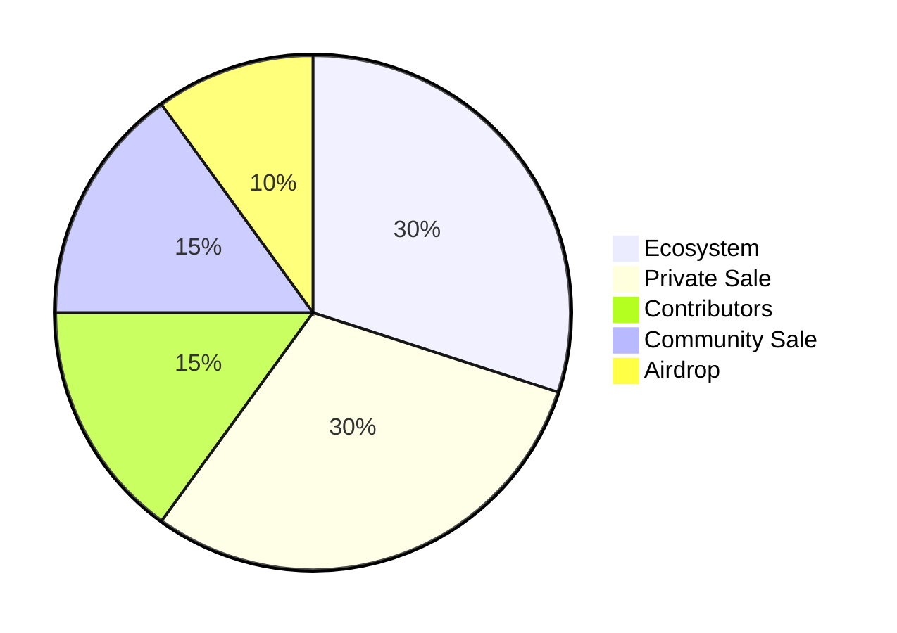

# Tokenomics

The LOFI tokenomics is designed to ensure a fair distribution of the token and to incentivize the community to participate in the ecosystem. The tokenomics is divided into the following categories:

- **Ecosystem (30%)**: Stashed for the development of the LOFI ecosystem.

- **Private Sale (30%)**: For multiple private sales that will be conducted to raise funds and attract strategic investors.

- **Contributors (15%)**: For partners and contributors who have helped in the development of the LOFI ecosystem.

- **Community Sale (15%)**: For the community sale that will be conducted.

- **Airdrop (10%)**: To thank the community for their support and to incentivize them to participate in the ecosystem. The airdrop will be conducted in multiple phases and will be announced on the official channels of LOFI.
